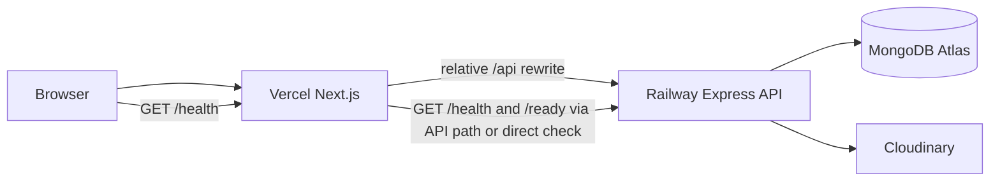

# Backend Deployment Plan

## Recommendation

Deploy the Express API as one Railway service for the MVP. Use the repository root as the service/workspace context because the root `package.json` defines the npm workspaces and the root build includes both workspaces.

Recommended topology:

The browser uses relative `/api/...` requests. Vercel rewrites them to Railway through `BACKEND_ORIGIN`. Railway exposes `/health` for liveness and `/ready` for MongoDB readiness.

## Railway configuration

- Service source: the repository root.
- Build command: `npm run build`. The current root script runs `npm --workspace backend run build && npm --workspace frontend run build`; this builds both workspaces. Confirm Railway uses the repository root before release.
- Current production start script: none exists in `backend/package.json` or the root `package.json`.
- Required pre-deployment action: configure Railway's start command explicitly as `node backend/dist/server.js`, or add and validate a root production start script that invokes that command. This is a release blocker until the provider can start the compiled backend reliably. Do not use `tsx` in production.
- Port: Railway supplies `PORT`; the app reads it and must bind to the provider-provided port. Confirm the app listens on the expected interface and port in a staging deployment.
- Health check: use `GET /health` for liveness. Use `GET /ready` for readiness; it returns 200 only when Mongoose is connected and 503 otherwise.

## Runtime operations

Set all backend variables from [ENVIRONMENT_VARIABLES.md](ENVIRONMENT_VARIABLES.md). Keep Railway logs free of credentials, tokens, request bodies, and provider internals. Retain structured provider logs according to the chosen plan and alert on startup failure, repeated readiness failures, elevated 5xx responses, latency, and restarts.

The current server connects to MongoDB before listening. It handles `SIGINT` and `SIGTERM` by closing the HTTP server, disconnecting Mongoose, and exiting. Allow the provider's graceful shutdown window to complete; do not terminate instances immediately during deploys.

Start with one small service instance. After performance and resource validation, scale vertically first, then horizontally if the API remains stateless and MongoDB connection limits are reviewed. Validate rate limits and connection pool behavior before increasing replica count.

## Deploy order

1. Create Atlas database, user, network access, backups, and controlled indexes.
2. Create Cloudinary production folder and credentials.
3. Configure Railway secrets and deploy the backend.
4. Verify Railway `/health`, `/ready`, logs, CORS, authentication, upload, and shutdown behavior.
5. Configure Vercel `BACKEND_ORIGIN` to the Railway origin and deploy the frontend.
6. Run authenticated browser and API smoke tests through the Vercel domain.

## Provider comparison

| Provider | Cost planning | Simplicity | Scalability | MVP suitability |
| --- | --- | --- | --- | --- |
| Railway | Usage-based; assume $5-$20/month for a small service, verify current pricing | Very simple for a workspace-based Node service | Good for early vertical and horizontal growth | Primary recommendation |
| Render | Usage-based; verify current pricing and free-tier limits | Simple, clear web-service model | Good, with straightforward managed services | Close alternative; choose it if predictable service settings, native health checks, or team familiarity outweigh Railway's workspace convenience |
| Vercel | Frontend-focused pricing; not the backend target here | Excellent for Next.js, poor fit for this long-running Express process | Excellent frontend scale; backend model differs | Use for frontend only |
| VPS | Low fixed entry cost, but operations are self-managed | Lowest platform simplicity | Manual scaling, patching, and failover | Not preferred for MVP due to operational burden |
| AWS | Broad usage-based pricing and more components | Highest setup and operations complexity | Highest range of scaling and networking options | Defer until traffic, compliance, or networking needs justify it |

Official references: [Railway pricing](https://railway.com/pricing), [Render pricing](https://render.com/pricing), [Vercel pricing](https://vercel.com/pricing), [AWS pricing](https://aws.amazon.com/pricing/).

## Blockers and caveats

Backend build and the 68-test suite pass, but production service configuration and real staging smoke tests have not been completed. Performance, memory/resource, and database-integrity validation remain open. The absent production start script/configuration must be resolved and tested before GO status.
