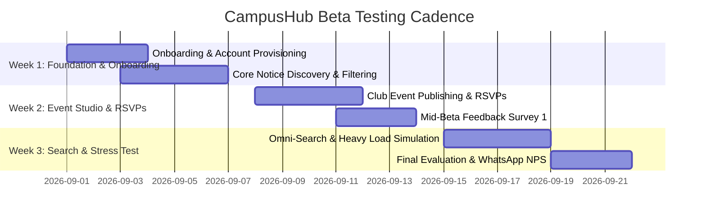

# CampusHub Beta Test Plan (Bucket L0)

**Project:** CampusHub — Student Sanctuary & Multi-Tenant Campus Operating System  
**Phase:** Bucket L0 (Closed Beta & User Validation)  
**Primary Research Objective:** Validate whether students and faculty prefer CampusHub over unstructured WhatsApp groups for official announcements and campus event participation.  
**Duration:** 3 Weeks (Sprint 1 to Sprint 3)  
**Target Cohort Size:** 150 – 200 Beta Participants (across 3 Colleges / 5 Departments)  

---

## 1. Problem Statement & Core Hypothesis

### The Problem with WhatsApp for Campus Operations
* **Information Noise & Dilution:** Critical circulars (exam notices, fees, deadlines) get buried under hundreds of student chat messages, memes, and forwards.
* **Lack of Verification:** Unofficial forwards cause panic and confusion; no official signature or authority verification.
* **No Searchability or Filtering:** Searching for a PDF circular from 3 weeks ago requires endless media scrolling.
* **Zero Event Management:** Event promotion in WhatsApp groups lacks attendee tracking, capacity enforcement, or digital ticket confirmation.

### Core Hypotheses
* **Hypothesis 1 (Signal-to-Noise):** ≥ 80% of participating students will report finding official announcements faster and with less stress on CampusHub compared to WhatsApp.
* **Hypothesis 2 (Event Conversion):** Event RSVPs and attendance tracking via CampusHub's digital passbook will see ≥ 60% higher confirmed turnouts compared to informal Google Forms/WhatsApp links.
* **Hypothesis 3 (Faculty Efficiency):** Faculty will save ≥ 5 hours/week by broadcasting notices to targeted department scopes rather than forwarding to multiple class representative groups.

---

## 2. Beta Testing Cohorts & Personas

| Cohort | Target Count | Persona Description | Key Assigned Test Scenarios |
| :--- | :---: | :--- | :--- |
| **Cohort 1: First-Year Students** | 60 | High informational anxiety; need reliable orientation, timetable, and department notices. | Daily check-in, notice search, department filtering, attending college-wide orientation events. |
| **Cohort 2: Club Leads & Society Heads** | 25 | Active event organizers (Tech Club, Cultural Society, E-Cell). | Creating events with posters, setting capacities, viewing real-time attendee rosters. |
| **Cohort 3: Class Representatives (CRs)** | 20 | The bridge between faculty and students; currently burdened with WhatsApp forwarding. | Validating announcement clarity, broadcasting reminders, collecting peer sentiment. |
| **Cohort 4: Faculty & Department Heads** | 15 | Academic authority drafting official circulars and symposium notices. | Notice creation studio, department targeting, Cloudinary flyer uploads, event moderation. |
| **Cohort 5: General Students (2nd–4th Year)** | 60 | Experienced students balancing academics, placements, and campus festivals. | Omni-search, passbook management, RSVP cancellation, filtering notices by department. |

---

## 3. Three-Week Phased Timeline

### Week 1: Onboarding, Notice Discovery & Signal vs. Noise (Days 1–7)
* **Focus:** First impressions, account setup, navigation, reading circulars, department filtering.
* **Key Milestone:** All 180 testers log in, update department affiliation, and view their personalized Aangan Courtyard.
* **Benchmark:** Measure time taken to find a specific examination circular on CampusHub vs. WhatsApp.

### Week 2: Campus Life & Event RSVP System (Days 8–14)
* **Focus:** Utsav discovery, Event Studio creation by club leads, capacity management, ticket generation, and passbook management.
* **Key Milestone:** Host 4 live mock campus events (e.g. "Annual Hackathon", "Guest Lecture on AI", "Cultural Evening").
* **Benchmark:** Measure RSVP completion rate, capacity limit hit response (`409 Conflict`), and passbook retrieval.

### Week 3: Omni-Search, Cross-Department Feeds & Final Evaluation (Days 15–21)
* **Focus:** Text search across large historical circular datasets, admin governance moderation, edge cases, mobile responsiveness.
* **Key Milestone:** Distribution and analysis of the comprehensive **Feedback & WhatsApp Comparison Survey**.

---

## 4. Success Metrics & Key Performance Indicators (KPIs)

### Quantitative KPIs
| Metric | Benchmark / Target | Measurement Method |
| :--- | :---: | :--- |
| **Daily Active Usage (DAU/MAU)** | ≥ 65% | Server access logs & session verification |
| **Notice Discovery Time** | < 15 seconds (vs ~3 mins on WhatsApp) | Timed user testing tasks |
| **Event RSVP Completion Rate** | ≥ 75% of active users reserve ≥ 1 pass | Database `EventRSVP` counts |
| **Search Success Rate** | ≥ 90% queries yield relevant circular/event | Search query telemetry |
| **Zero Data Leakage / Tenant Breaches** | 100% Isolation (0 breaches) | Multi-tenant audit logs |

### Qualitative & Comparative KPIs
| Dimension | WhatsApp Group Benchmark | CampusHub Target |
| :--- | :--- | :--- |
| **Information Clarity** | 2.8 / 5.0 (Noisy, buried) | ≥ 4.5 / 5.0 (Clean, formatted) |
| **Verification & Trust** | 3.1 / 5.0 (Unverified forwards) | ≥ 4.8 / 5.0 (Authenticated faculty badge) |
| **Event Participation Experience** | 2.5 / 5.0 (External Google Forms) | ≥ 4.6 / 5.0 (1-Click Passbook Tickets) |
| **Net Promoter Score (NPS)** | N/A | ≥ +50 |
| **Preference over WhatsApp** | Baseline | ≥ 80% prefer CampusHub for official updates |

---

## 5. Beta Test Infrastructure & Environment

* **Staging Server:** Render / Railway Node.js environment with production-equivalent configs (`NODE_ENV=production`).
* **Database:** MongoDB Atlas isolated beta cluster with automated daily snapshots.
* **Media CDN:** Cloudinary dedicated sandbox folder (`campushub-beta`).
* **Frontend Web App:** Vercel staging deployment mapped to custom subdomain `beta.campushub.edu`.
* **Telemetry & Crash Reporting:** Backend structured JSON logs, HTTP health probes `/health` and `/ready`.

---

## 6. Exit Criteria for Beta Testing

Before approving public v1.0 release, the beta must meet all of the following:
1. **Critical Bugs:** Zero P0 (blocker) and zero P1 (critical security/data integrity) open bugs.
2. **Satisfaction Rating:** Minimum 80% of survey respondents vote "Prefer CampusHub over WhatsApp" for official communications.
3. **Capacity & RSVP Reliability:** 100% of event RSVPs issued valid unique tickets with accurate capacity decrementing.
4. **Performance:** Median page load under 1.2s on standard 4G mobile networks.
