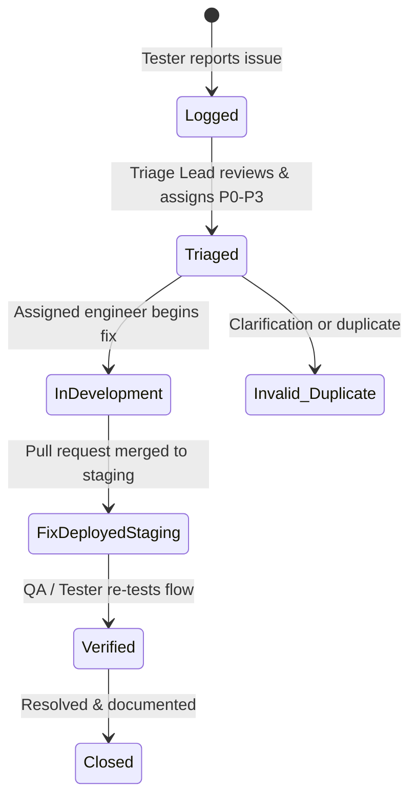

# CampusHub Bug Triage & Issue Resolution Process (Bucket L0)

**Project:** CampusHub — Student Sanctuary & Multi-Tenant Campus Operating System  
**Phase:** Beta Testing & Production Release Readiness  
**Objective:** Establish a rapid, disciplined, and transparent protocol for logging, triaging, prioritizing, and resolving defects discovered during the Beta testing program.

---

## 1. Bug Lifecycle

---

## 2. Severity & Priority Classification Matrix

Every incoming defect is evaluated on two axes: **Business/Security Impact** and **Frequency of Occurrence**.

| Priority | Severity Level | Definition & Examples | Target Resolution SLA |
| :--- | :--- | :--- | :---: |
| 🔴 **P0** | **Blocker / Critical Security** | • Multi-tenant data leakage (College A sees College B notices). • Authentication completely broken / 500 error on login. • Data corruption or permanent crash on core routes (`/`, `/events`). | **< 4 Hours** (Immediate Hotfix) |
| 🟠 **P1** | **Critical Functional Defect** | • Event RSVP fails with 500 when capacity is available. • Cloudinary poster upload fails consistently. • Department visibility filter exposes restricted faculty circulars. • Search returns 500 on valid queries. | **< 24 Hours** |
| 🟡 **P2** | **Major UX / Non-Blocking Defect** | • RSVP pass cancellation works on backend but UI requires manual refresh. • Layout overflow or clipping on mobile Safari. • Toast notification or error message unclear or misaligned. • Admin user pagination offset calculation glitch. | **< 3 Days** |
| 🟢 **P3** | **Minor Defect / Cosmetic Flaw** | • Minor typography spacing inconsistency in Kintsugi tokens. • Missing tooltip or subtle hover animation glitch. • Browser console warning (non-fatal). | **Next Sprint Cycle** |

---

## 3. Daily Beta Triage Cadence

During the 3-week beta period, the engineering and product team will hold a **Daily 15-Minute Async/Sync Triage Sync** at 10:00 AM:

1. **Review New Inflow:** Review all submissions logged in `FEEDBACK_FORM.md` or Beta issue trackers in the last 24 hours.
2. **Reproduce & Isolate:** Validate reproduction steps against the staging environment (`beta.campushub.edu`).
3. **Classify & Assign:** Assign priority tag (P0–P3) and tag a dedicated engineering owner.
4. **Track In-Flight Fixes:** Verify whether deployed staging fixes are ready for tester re-verification.

---

## 4. Triage Checklist for Reviewers

When triaging a reported issue, the Triage Lead must verify:
- [ ] **Multi-Tenant Check:** Does this issue affect tenant boundary enforcement? (If yes, auto-elevate to **P0**).
- [ ] **Reproducibility:** Is there a clear set of reproduction steps and sample payload?
- [ ] **Scope of Impact:** Is it isolated to a specific browser/device (e.g. iOS Safari) or universal across all platforms?
- [ ] **Regression Potential:** Does fixing this require backend schema or API route modifications?

---

## 5. Hotfix & Production Deployment Protocol

For **P0** and **P1** issues requiring emergency resolution:

1. **Branching:** Create hotfix branch `hotfix/issue-description` from `main`.
2. **Test-First TDD Rule:** Write a failing test in `backend/src/test/` reproducing the exact bug before modifying production code.
3. **Code Fix & Regression Suite:** Apply fix and run the full test suite (`npm test`) to ensure zero regressions.
4. **Peer Review:** Minimum 1 peer code review approval required.
5. **Staging Smoke Test:** Deploy to staging and verify with the original bug reporter.
6. **Deploy & Announce:** Deploy to production, update `PROJECT_STATUS.md`, and notify beta testers.
