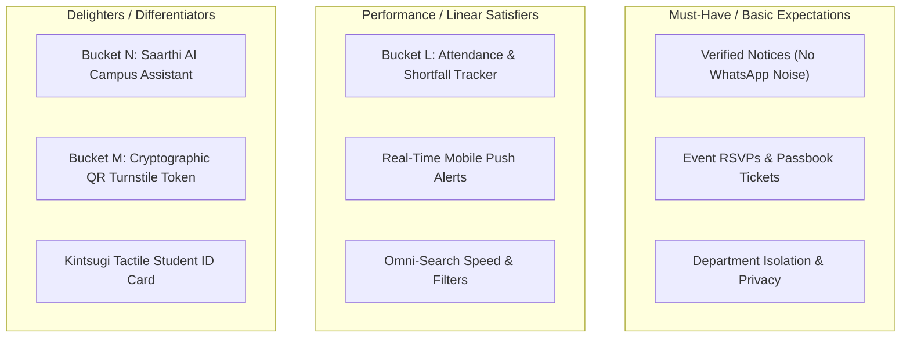

# CampusHub Feature Prioritization Framework (Bucket L0)

**Project:** CampusHub — Student Sanctuary & Multi-Tenant Campus Operating System  
**Objective:** Establish an objective, data-backed methodology to evaluate, score, and sequence post-beta feature requests based on user feedback, academic utility, and strategic differentiation from WhatsApp.

---

## 1. The CampusHub Scoring Model (Adapted RICE Framework)

To ensure engineering resources focus on the highest-value student and faculty needs, all candidate features are scored using the **RICE** model adapted for campus ecosystems:

$$\text{RICE Score} = \frac{\text{Reach} \times \text{Impact} \times \text{Confidence}}{\text{Effort}}$$

---

### Scoring Dimension Guidelines

| Dimension | Description | Scoring Scale & Definitions |
| :--- | :--- | :--- |
| **Reach (R)** | Estimated number of unique users (students, faculty, club leads) impacted within a typical 30-day academic cycle. | • **100% (1.0):** Entire student & faculty body. • **75% (0.75):** All students (academic tracking). • **25% (0.25):** Club leads / event organizers. • **5% (0.05):** System administrators only. |
| **Impact (I)** | Degree to which the feature solves a painful campus problem (e.g. eliminating WhatsApp chaos, preventing missed deadlines). | • **3.0 (Massive):** Fundamental daily necessity (Attendance, Exam timetable). • **2.0 (High):** Major workflow enhancement (Mobile push alerts, Instant RSVP). • **1.0 (Medium):** Moderate convenience (Syllabus PDF downloader). • **0.5 (Low):** Minor cosmetic customization. |
| **Confidence (C)** | Degree of confidence based on Beta User Survey data (`FEEDBACK_FORM.md`) and direct student interviews. | • **100% (1.0):** High confidence (backed by ≥70% survey demand). • **80% (0.8):** Medium confidence (backed by feedback themes). • **50% (0.5):** Low confidence / speculative idea. |
| **Effort (E)** | Total engineering person-weeks required to design, develop, test (TDD), and deploy the feature. | Measured in estimated **Engineering Weeks** (1 to 6 weeks). |

---

## 2. Kano Model Categorization for Campus Features

Features are also cross-referenced against the **Kano Model** to balance core table-stakes with delightful innovations:

1. **Must-Haves (Table Stakes):** If missing, students will abandon CampusHub and return to WhatsApp (e.g. fast notice delivery, reliable RSVP tickets).
2. **Performance Satisfiers:** More is better; directly drives daily active engagement (e.g. real-time attendance percentage buffers, live timetables).
3. **Delighters:** Unexpected premium touches that build emotional connection and institutional pride (e.g. Saarthi AI circular search, tactile digital ID card).

---

## 3. Post-Beta Feature Evaluation Matrix

Below is the initial baseline evaluation of candidate post-beta initiatives:

| Feature Candidate | Target User Group | Reach | Impact | Confidence | Effort (Wks) | RICE Score | Kano Class | Rank |
| :--- | :--- | :---: | :---: | :---: | :---: | :---: | :---: | :---: |
| **Bucket L: Pathshala Academic Hub & Attendance Tracking** | All Students & Faculty | 1.00 | 3.0 | 100% (1.0) | 2.0 | **1.50** | Performance | 🥇 **#1** |
| **Real-Time Push Notifications & Emergency Broadcasts** | All Campus Users | 1.00 | 2.5 | 90% (0.9) | 1.5 | **1.50** | Performance | 🥈 **#2** |
| **Bucket N: Saarthi AI Campus Companion (Gemini RAG)** | All Students | 0.80 | 2.5 | 85% (0.85) | 2.0 | **0.85** | Delighter | 🥉 **#3** |
| **Bucket M: Cryptographic Digital Pass & Turnstile Scanner** | Students & Security Staff | 0.70 | 2.0 | 80% (0.8) | 1.5 | **0.75** | Delighter | **#4** |
| **Course Notes & Resource Sharing Studio** | Students & Faculty | 0.60 | 1.5 | 80% (0.8) | 1.5 | **0.48** | Satisfier | **#5** |

---

## 4. Decision Rule & Product Roadmap Sequencing

1. **Top Priority (Immediate Next Sprint):**
   * **Bucket L (Pathshala Academic Hub)** ranks highest because it provides daily active utility (attendance calculations, class schedules) and replaces the last placeholder on the Aangan Home Screen.
2. **Second Priority:**
   * **Push Notifications (PWA / Web Push)** directly addresses the primary risk identified in Beta onboarding: ensuring students receive urgent circular alerts without needing to open the browser manually.
3. **Third Priority:**
   * **Bucket N (Saarthi AI Workspace)** delivers the signature AI intelligence differentiator, enabling instant natural language queries over all college circulars.
