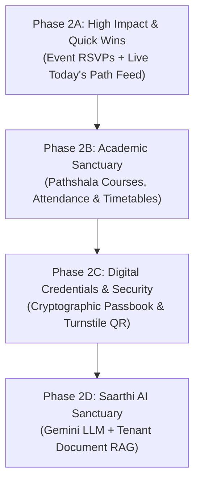

# KINTSUGI INTEGRATION AUDIT & PRODUCTION READINESS REPORT

**Product:** CampusHub — Student Sanctuary & Digital Campus  
**Design Foundation:** Kintsugi Academic (Japanese Minimalism × Indian Heritage)  
**Audit Date:** August 29, 2026  
**Scope:** Frontend UI Screens, Component State Integrations, and Backend API Parity  

---

## 1. Executive Summary & Integration Matrix

This audit evaluates all redesigned screens across the 6 core architectural Buckets (*Kintsugi, Torii, Aangan, Pathshala, Utsav, Saarthi*) to determine exact production API connectivity versus placeholder/mock states.

| Screen / Module | Route | Production API Status | Mock / Placeholder Status | % Production Connected |
| :--- | :--- | :--- | :--- | :---: |
| **Aangan Courtyard (Home)** | `/`, `/announcements` | ✅ Announcements Feed, Department Filters, Auth, Cloudinary Upload, Notice Details | ⚠️ "Today's Path" Bento Classes, Academic Health Gauge, Next Milestone, Saarthi Insight | **70%** |
| **Announcement Studio** | Embedded in `/announcements` | ✅ Title, Description, Target Department, Cloudinary Upload, Publishing | None (100% Live) | **100%** |
| **Utsav Campus Life** | `/events`, `/events/[id]` | ✅ Event Feed, Event Creation, Department Tags, Cloudinary Upload, Single View | ⚠️ RSVP Pass Persistence (Local state only), Featured Flag | **80%** |
| **Utsav Event Studio** | Embedded in `/events` | ✅ Form Submission, Datetime, Venue, Department, Cloudinary Streaming | None (100% Live) | **100%** |
| **Admin Governance Console** | `/admin` | ✅ Metrics Aggregation, User Governance, College & Dept CRUD, Moderation Deletes | ⚠️ Audit Log Streams, Trend Forecast Percentages | **90%** |
| **Admin Sub-Sanctuaries** | `/admin/users`, `/colleges`, `/departments`, etc. | ✅ Live Database CRUD & User Role Elevation (`PATCH /api/admin/users/:id/role`) | None (100% Live) | **100%** |
| **Omni-Search** | `/search` | ✅ Regex Text Search across Notices & Events Collections with Tenant Isolation | None (100% Live) | **100%** |
| **Pathshala Learning Hub** | `/academic` | ✅ User Auth & Session Verification | ⚠️ Enrolled Courses, Attendance Health %, Class Schedules, Syllabus Drawers | **15%** |
| **Passbook & Digital ID** | `/passes` | ✅ User Name & Email Verification | ⚠️ Student ID Number, Dynamic Cryptographic QR Pass, Wallet Export | **20%** |
| **Saarthi AI Workspace** | `ToriiNav` Modal Trigger | None (Visual Preview / Non-functional state as constrained) | ⚠️ Gemini LLM Pipeline, Vector Search over Campus Circulars, Query Context | **0%** |

---

## 2. Detailed Screen-by-Screen Audit

### 2.1. Bucket 3: Aangan Student Home Experience
**Routes:** [`/`](file:///c:/Users/Lenovo/Desktop/PROJECT%20CREATED/campushub/frontend/app/page.jsx), [`/announcements`](file:///c:/Users/Lenovo/Desktop/PROJECT%20CREATED/campushub/frontend/app/announcements/page.jsx), [`/announcements/[id]`](file:///c:/Users/Lenovo/Desktop/PROJECT%20CREATED/campushub/frontend/app/announcements/%5Bid%5D/page.jsx)

* **Connected to Production APIs:**
  * `GET /api/announcements`: Fetches active, tenant-isolated circulars from MongoDB with pagination.
  * `GET /api/me`: Fetches authenticated user's name, email, role, and college ID.
  * `GET /api/departments`: Loads institutional departments for category filter chips.
  * `POST /api/announcements`: Handles announcement creation with markdown descriptions and department targeting.
  * `POST /api/uploads/poster`: Multipart file upload stream directly to Cloudinary.
  * `GET /api/announcements/:id`: Retrieves individual circular metadata and poster URLs.
* **Using Mock / Placeholder Data:**
  1. **"Today's Path" Bento Grid:** Hardcoded lectures (*Advanced Algorithms in Room 402, Design Thinking Lab in Studio 2*) and urgent tasks (*HCI Research Paper due 11:59 PM*).
  2. **Academic Health Gauge:** Hardcoded 88% overall attendance bar, 3.8 CGPA circle, and 0 shortfall calculation.
  3. **Next Milestone:** Static string (*Midterms in 14 Days*).
  4. **Saarthi Daily Insight:** Hardcoded prompt advice text.

---

### 2.2. Bucket 5: Utsav Campus Life & Gathering Studio
**Routes:** [`/events`](file:///c:/Users/Lenovo/Desktop/PROJECT%20CREATED/campushub/frontend/app/events/page.jsx), [`/events/[id]`](file:///c:/Users/Lenovo/Desktop/PROJECT%20CREATED/campushub/frontend/app/events/%5Bid%5D/page.jsx)

* **Connected to Production APIs:**
  * `GET /api/events`: Fetches scheduled campus events, timestamps, and venues.
  * `GET /api/events/:id`: Fetches single event view with poster image and department metadata.
  * `POST /api/events`: Creates campus events with ISO datetime, location, and department scope.
  * `POST /api/uploads/poster`: Uploads event flyers/posters to Cloudinary.
  * `GET /api/departments`: Loads hosting societies and departments.
* **Using Mock / Placeholder Data:**
  1. **RSVP Pass Button:** Toggles UI state locally via React `useState(false)`. No RSVP record or attendee registration is persisted in MongoDB.
  2. **Featured Spotlight Selection:** Selects `events[0]` instead of an explicit database-backed `isFeatured` or `trendingScore` attribute.

---

### 2.3. Bucket 2 & Admin: Admin Governance Sanctuary
**Routes:** [`/admin`](file:///c:/Users/Lenovo/Desktop/PROJECT%20CREATED/campushub/frontend/app/admin/page.jsx), [`/admin/users`](file:///c:/Users/Lenovo/Desktop/PROJECT%20CREATED/campushub/frontend/app/admin/users/page.jsx), [`/admin/colleges`](file:///c:/Users/Lenovo/Desktop/PROJECT%20CREATED/campushub/frontend/app/admin/colleges/page.jsx), [`/admin/departments`](file:///c:/Users/Lenovo/Desktop/PROJECT%20CREATED/campushub/frontend/app/admin/departments/page.jsx), [`/admin/announcements`](file:///c:/Users/Lenovo/Desktop/PROJECT%20CREATED/campushub/frontend/app/admin/announcements/page.jsx), [`/admin/events`](file:///c:/Users/Lenovo/Desktop/PROJECT%20CREATED/campushub/frontend/app/admin/events/page.jsx)

* **Connected to Production APIs:**
  * `GET /api/admin/metrics`: Real aggregate counts from MongoDB (`totalUsers`, `totalAnnouncements`, `totalEvents`, `totalColleges`, `totalDepartments`).
  * `GET /api/admin/users?search=...&role=...&collegeId=...`: Real-time user filtering.
  * `PATCH /api/admin/users/:id/role`: Real-time permission elevation (`student`, `faculty`, `admin`).
  * `POST /api/admin/colleges`, `PATCH /api/admin/colleges/:id`: Live institutional charter creation and editing.
  * `POST /api/admin/departments`, `PATCH /api/admin/departments/:id`: Live department registry.
  * `DELETE /api/admin/announcements/:id` & `DELETE /api/admin/events/:id`: Real-time content moderation deletes.
* **Using Mock / Placeholder Data:**
  1. **Telemetry Sub-badges:** Static growth labels (`+12% this sem`, `Isolated tenants`).
  2. **Audit Activity Log:** Not yet backed by an immutable system event collection.

---

### 2.4. Omni-Search & Discovery
**Route:** [`/search`](file:///c:/Users/Lenovo/Desktop/PROJECT%20CREATED/campushub/frontend/app/search/page.jsx)

* **Connected to Production APIs:**
  * `GET /api/search?q=...`: 100% Production Connected. Executes parallel queries against `announcements` and `events` MongoDB collections scoped to the user's `collegeId`.
* **Using Mock / Placeholder Data:** None.

---

### 2.5. Bucket 4: Pathshala Academic Hub
**Route:** [`/academic`](file:///c:/Users/Lenovo/Desktop/PROJECT%20CREATED/campushub/frontend/app/academic/page.jsx)

* **Connected to Production APIs:**
  * `GET /api/me`: Authenticates student session.
* **Using Mock / Placeholder Data:**
  1. **Course Lockers:** Hardcoded list of 4 courses (Algorithms, Distributed Databases, HCI, DSP).
  2. **Attendance Telemetry:** Static 88.4% calculation, +6 buffer classes, and Grade A badge.
  3. **Timetable / Room Locations:** Static hall numbers.
  4. **Syllabus & Documents:** Non-functional buttons.

---

### 2.6. Digital Passbook & Credentials
**Route:** [`/passes`](file:///c:/Users/Lenovo/Desktop/PROJECT%20CREATED/campushub/frontend/app/passes/page.jsx)

* **Connected to Production APIs:**
  * `GET /api/me`: Authenticates user and fetches profile name and email.
* **Using Mock / Placeholder Data:**
  1. **Student ID Badge:** Mock student ID (`#APEX-2026-4892`) and expiration date (`June 2028`).
  2. **Dynamic Entry QR Code:** Visual icon placeholder; no cryptographically signed, rotating TOTP/JWT payload generated or verified by an access turnstile endpoint.

---

### 2.7. Bucket 6: Saarthi AI Companion
**Trigger:** `ToriiNav` "Ask Saarthi" CTA & Sidebar Button

* **Connected to Production APIs:** None (constrained to visual placeholder in Phase 1).
* **Using Mock / Placeholder Data:**
  1. Modal preview dialog explaining the feature with mock suggested prompts.
  2. Non-interactive input box marked `[Preview Mode — Backend AI pipeline in phase 2]`.

---

## 3. Backend Schema & API Gap Analysis

To bring all mock and placeholder screens to 100% production functionality, the backend requires the following new models, controllers, and endpoints:

### Gap 1: Event RSVPs & Ticket Passes
* **Missing Model:** `EventRSVP` (`userId`, `eventId`, `collegeId`, `ticketNumber`, `status: "confirmed"|"cancelled"`, `qrCode`, `createdAt`).
* **Missing Endpoints:**
  * `POST /api/events/:id/rsvp`: Reserve pass and generate ticket.
  * `DELETE /api/events/:id/rsvp`: Cancel pass reservation.
  * `GET /api/events/:id/rsvp`: Check user's RSVP status and retrieve digital ticket.
  * `GET /api/me/passes`: List all active event passes for the current student.

### Gap 2: Pathshala Academic & Attendance Management
* **Missing Models:**
  * `Course`: `courseCode`, `title`, `credits`, `departmentId`, `instructorId`, `syllabusUrl`.
  * `Enrollment`: `studentId`, `courseId`, `semester`, `attendancePercentage`, `attendedClasses`, `totalClasses`.
  * `TimetableSlot`: `courseId`, `dayOfWeek`, `startTime`, `endTime`, `roomNumber`, `building`.
* **Missing Endpoints:**
  * `GET /api/academic/courses`: Enrolled subjects for current student.
  * `GET /api/academic/attendance`: Real-time attendance percentage, shortfall alerts, and buffer counts.
  * `GET /api/academic/schedule/today`: Real-time "Today's Path" classes based on current day and time.

### Gap 3: Digital Campus Pass & Cryptographic QR Verification
* **Missing Logic:**
  * Signed JWT / TOTP payload generation embedding `{ studentId, collegeId, role, expiresAt }`.
* **Missing Endpoints:**
  * `GET /api/passes/digital-id`: Generates time-bounded signed QR token for physical turnstile scanning.
  * `POST /api/passes/verify`: Turnstile/Guard scanner endpoint validating entry tokens against active enrollments.

### Gap 4: Saarthi AI Assistant (RAG Pipeline)
* **Missing Services:**
  * Google Gemini API (`@google/genai`) integration.
  * Vector embedding index / MongoDB Atlas Vector Search on `announcements` and academic circulars.
* **Missing Endpoints:**
  * `POST /api/saarthi/chat`: Context-aware conversational endpoint strictly bounded by tenant announcements, exam dates, and course syllabi.

---

## 4. Prioritized Implementation Plan for 100% Production Connectivity

---

### 🟢 Phase 2A — High Impact & Immediate Wins (Effort: Low | Impact: High)
1. **Event RSVP & Ticket Registration API:**
   - Create `EventRSVP` Mongoose model.
   - Implement `POST /api/events/:id/rsvp` and `GET /api/events/:id/rsvp`.
   - Update [`EventCard.jsx`](file:///c:/Users/Lenovo/Desktop/PROJECT%20CREATED/campushub/frontend/components/EventCard.jsx) and [`events/[id]/page.jsx`](file:///c:/Users/Lenovo/Desktop/PROJECT%20CREATED/campushub/frontend/app/events/%5Bid%5D/page.jsx) to persist real RSVPs to MongoDB.
2. **Editorial Featured Event Flag:**
   - Add `isFeatured: { type: Boolean, default: false }` to `event.model.ts`.
   - Allow admins to toggle spotlight status.
3. **Connect Passbook to Real Event RSVPs:**
   - Update [`passes/page.jsx`](file:///c:/Users/Lenovo/Desktop/PROJECT%20CREATED/campushub/frontend/app/passes/page.jsx) to dynamically render all real RSVP event passes from `GET /api/me/passes`.

---

### 🟡 Phase 2B — Pathshala Academic Architecture (Effort: Medium | Impact: High)
1. **Academic Database Models:**
   - Create `Course`, `Enrollment`, and `TimetableSlot` schemas with strict tenant isolation.
2. **Academic Controllers & Routes:**
   - Implement `GET /api/academic/courses`, `GET /api/academic/attendance`, and `GET /api/academic/schedule/today`.
3. **Frontend Integration:**
   - Connect [`academic/page.jsx`](file:///c:/Users/Lenovo/Desktop/PROJECT%20CREATED/campushub/frontend/app/academic/page.jsx) to live course rosters and calculated attendance safety buffers.
   - Wire "Today's Path" in [`announcements/page.jsx`](file:///c:/Users/Lenovo/Desktop/PROJECT%20CREATED/campushub/frontend/app/announcements/page.jsx) to pull real classes scheduled for the current day.

---

### 🟠 Phase 2C — Digital Passbook & Turnstile Verification (Effort: Medium | Impact: Medium)
1. **Cryptographic Token Generator:**
   - Implement signed TOTP/JWT payload generation with 60-second automatic rotation.
2. **Frontend QR Rendering:**
   - Use standard SVG QR code generator library (e.g. `qrcode.react`) to render real dynamic tokens in [`passes/page.jsx`](file:///c:/Users/Lenovo/Desktop/PROJECT%20CREATED/campushub/frontend/app/passes/page.jsx).
3. **Turnstile Scanner Route:**
   - Implement `POST /api/passes/verify` for security gate scanners.

---

### 🟣 Phase 2D — Saarthi AI Workspace & Multi-Tenant RAG (Effort: Medium-High | Impact: High)
1. **Gemini SDK Setup:**
   - Initialize `@google/genai` with `GEMINI_API_KEY`.
2. **Tenant-Bounded Knowledge Retrieval:**
   - Index circulars and event descriptions in MongoDB with vector embeddings.
   - Restrict Saarthi's context strictly to the student's `collegeId` and `departmentId`.
3. **Frontend Conversational Canvas:**
   - Upgrade the Saarthi Modal in [`ToriiNav.jsx`](file:///c:/Users/Lenovo/Desktop/PROJECT%20CREATED/campushub/frontend/components/ToriiNav.jsx) into a streaming chat interface with source citations.
