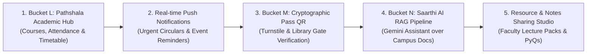

# CampusHub Product Readiness Review (Buckets A – K)

**Product:** CampusHub — Student Sanctuary & Multi-Tenant Campus Operating System  
**Design System:** Kintsugi Academic (Japanese Minimalism × Indian Heritage)  
**Date:** August 29, 2026  
**Audience:** Product Leads, Engineering Leads & Stakeholders  
**Current Milestone:** Bucket K (Event RSVP System) Completed & Validated  

---

## 1. Executive Summary

CampusHub has completed foundational architecture and functional modules through **Bucket K**. The core platform provides a secure, multi-tenant academic and campus life operating system supporting:
- Multi-college workspace isolation and department-targeted role-based access control (RBAC).
- A high-aesthetic **Kintsugi Academic** user experience across navigation, home courtyard, event calendar, and admin consoles.
- Full announcement publishing with Cloudinary-backed media streaming.
- Full event discovery and **Bucket K Event Participation** (capacity enforcement, idempotent ticket generation, student passbook, and attendee rosters).
- Cross-collection tenant-scoped omni-search.
- Production-grade security hardening, health probes, and comprehensive TDD test suites.

This document reviews what is production-ready, audits remaining placeholder screens, details technical debt, outlines the top 5 next features for maximum user ROI, and provides a strategic recommendation on **Beta Testing vs. Bucket L (Academic Module)**.

---

## 2. Feature Readiness Matrix (Production vs. Placeholder)

| Module / Experience | Primary Route(s) | Production API Connectivity | Placeholder / Mock Elements | Readiness State |
| :--- | :--- | :--- | :--- | :---: |
| **Authentication & RBAC** | `/login`, `/register`, `/api/auth/*` | ✅ 100% Live (JWT Cookies, Bcrypt, Role Middleware) | None | 🟢 **Production Ready** |
| **Torii Navigation Shell** | Global Dock & Utility Bar | ✅ 100% Live (Session status, role badges, routing) | None | 🟢 **Production Ready** |
| **Utsav Campus Life & Events** | `/events`, `/events/[id]` | ✅ 100% Live (CRUD, Cloudinary, Upcoming feed) | None | 🟢 **Production Ready** |
| **Event RSVP & Participation (Bucket K)** | `/events/[id]`, `/passes` | ✅ 100% Live (Capacity limits, Tickets, Passbook, Roster) | None | 🟢 **Production Ready** |
| **Announcement Studio & Feeds** | `/announcements`, `/announcements/[id]` | ✅ 100% Live (Department filters, Cloudinary upload, CRUD) | None | 🟢 **Production Ready** |
| **Omni-Search System** | `/search` | ✅ 100% Live (Regex text search across circulars & events) | None | 🟢 **Production Ready** |
| **Admin Governance Console** | `/admin/*` | ✅ 100% Live (Tenant metrics, User roles, Moderation) | Audit log streaming | 🟢 **Production Ready (95%)** |
| **Aangan Courtyard (Home)** | `/` | ✅ Announcements feed, user identity, department chips | ⚠️ "Today's Path" class timetable, Academic Health gauge | 🟡 **Hybrid (65% Live)** |
| **Passbook & Digital Credentials** | `/passes` | ✅ Active RSVP event tickets, pass cancellation | ⚠️ Rotating QR turnstile token, static Student ID card | 🟡 **Hybrid (60% Live)** |
| **Pathshala Academic Hub** | `/academic` | ✅ User authentication & session | ⚠️ Course lockers, attendance tracker, class schedules | 🔴 **Placeholder (15% Live)** |
| **Saarthi AI Assistant** | `ToriiNav` Trigger | None (Visual Preview / Non-functional state) | ⚠️ Gemini LLM pipeline, RAG document embeddings | 🔴 **Placeholder (0% Live)** |

---

## 3. Detailed Audit of Completed Production Features

### 3.1. Foundation & Multi-Tenancy (Buckets A, B)
- **Tenant Isolation:** Every document and database query enforces server-validated `collegeId` derived from verified JWT claims. Cross-college leakage is prevented at the route middleware and controller levels.
- **Role Hierarchy:** Granular authorization supporting `student`, `faculty`, and `admin` roles, with department scoping for localized circulars and lectures.

### 3.2. Communications & Media Stream (Buckets C, D)
- **Announcement System:** Faculty and administrators can draft, format, and broadcast college-wide or department-specific notices with optional banner media.
- **Media Pipeline:** Secure 5MB memory-buffered upload endpoint streaming directly to Cloudinary with MIME, extension, and content verification.

### 3.3. Utsav Campus Life & Bucket K Event Participation (Buckets E, K)
- **Event Lifecycle:** Publishing studio with ISO datetime validation, venue assignments, department restrictions, and nearest-first chronological feeds.
- **Capacity Management:** Optional seat cap validation rejecting oversold events with HTTP 409 Conflict; automatic spot re-allocation when reservations are cancelled.
- **Pass Generation:** Unique ticket generation format (`PASS-{eventIdLast4}-{randomBase36}`).
- **Passbook Integration:** Live `GET /api/me/passes` endpoint returning active tickets, rendered dynamically in the student passbook with single-click cancellation.
- **Organizer Governance:** Live attendee rosters accessible by admins and event creator faculty (`GET /api/admin/events/:id/attendees`).

### 3.4. Omni-Search & Discovery (Bucket F)
- Dual-collection search indexing announcements and events with MongoDB text weighting, tenant isolation, and relevance sorting.

### 3.5. Admin Governance Sanctuary (Bucket H)
- High-level tenant telemetry (user counts, notices, event volumes), real-time user management with role elevation, college/department CRUD, and content moderation.

### 3.6. Security & Operational Hardening (Bucket G, J0)
- Global Helmet security headers, route-specific rate limiters, sanitized text transforms (XSS defense), health check `/health`, and database readiness probe `/ready`.

---

## 4. Audit of Screens Using Placeholder / Mock Data

### 4.1. Aangan Courtyard (`/`)
1. **"Today's Path" Bento Grid:** Hardcoded timetable cards (*Advanced Algorithms in Room 402, Design Thinking Lab in Studio 2*) and urgent tasks (*HCI Research Paper due 11:59 PM*).
2. **Academic Health Gauge:** Hardcoded 88% overall attendance bar, 3.8 CGPA circle, and 0 shortfall calculation.
3. **Saarthi Daily Insight:** Static motivational/study tip string.

### 4.2. Pathshala Academic Hub (`/academic`)
1. **Course Lockers:** Static display of 4 hardcoded courses (Algorithms, Distributed Databases, HCI, Digital Signal Processing).
2. **Attendance Telemetry:** Hardcoded 88.4% attendance badge and +6 buffer classes.
3. **Timetable / Room Locations:** Static hall numbers.
4. **Syllabus & Course Packs:** Visual buttons without document downloading backend.

### 4.3. Digital Passbook (`/passes`)
1. **Tactile Student ID Card:** Visual representation using authenticated name/email, but static ID number `#APEX-2026-4892` and expiration date.
2. **Turnstile Entry QR Code:** Visual placeholder icon; no rotating signed TOTP/JWT payload generated or verified by a campus gate turnstile endpoint.
*(Note: Event Passes section on `/passes` is 100% connected to live database).*

### 4.4. Saarthi AI Companion (Torii Modal)
1. **Conversational Interface:** Preview modal explaining AI capabilities with mock suggestion chips; no backend connection to Gemini API.

---

## 5. Technical Debt & Non-Functional Audit

1. **Frontend Dependencies:**
   - Minor Next.js / PostCSS dependency audit alerts requiring an upgraded major release and regression testing.
2. **End-to-End Test Automation:**
   - Backend has comprehensive unit, integration, and security test coverage (Vitest).
   - Frontend currently lacks automated browser E2E test suites (Playwright/Cypress).
3. **Real-time Event Streaming:**
   - Announcement and event updates rely on HTTP request fetching rather than WebSockets (Socket.io) or Server-Sent Events (SSE).
4. **Data Lifecycle & Archival:**
   - Deletions are hard deletes directly removing MongoDB documents rather than soft deletes (`isDeleted: true`).
5. **Audit Logging:**
   - Admin actions (role elevations, moderation deletes) are logged to stdout but not persisted to a queryable `AuditLog` database collection.

---

## 6. Top 5 Next Features for Maximum User Value

### Feature 1: Bucket L — Pathshala Academic Hub & Attendance Tracking
* **User Value:** **HIGHEST (Daily Essential)**
* **Scope:** 
  - Schemas: `Course`, `Enrollment`, `TimetableSlot`, `AttendanceRecord`.
  - Endpoints: `GET /api/academic/courses`, `GET /api/academic/attendance`, `GET /api/academic/schedule/today`.
  - Impact: Converts the mock "Today's Path" and "Academic Health Gauge" on the Aangan Home Screen into real-time, live student data.

### Feature 2: Real-time Push Notifications & Emergency Broadcasts
* **User Value:** **HIGH (Campus Safety & Timeliness)**
* **Scope:** Web Push API and email alerts for emergency notices, cancelled classes, and event ticket confirmations.

### Feature 3: Bucket M — Cryptographic Digital Pass & QR Turnstile Scanner
* **User Value:** **MEDIUM-HIGH (Physical Access & Security)**
* **Scope:** Time-based rotating signed QR code (`GET /api/passes/digital-id`) and gatekeeper scanner app (`POST /api/passes/verify`).

### Feature 4: Bucket N — Saarthi AI Campus Assistant (Gemini RAG Pipeline)
* **User Value:** **HIGH (Student Productivity & Innovation)**
* **Scope:** Gemini Flash integration (`@google/genai`) indexing tenant announcements, exam schedules, and course syllabi for conversational Q&A.

### Feature 5: Course Material & Resource Studio
* **User Value:** **MEDIUM (Academic Support)**
* **Scope:** Faculty PDF uploads for lecture presentations, past exam papers, and laboratory manuals with department tagging.

---

## 7. Strategic Recommendation: Beta Testing vs. Bucket L

### Option A: Launch Closed Beta Now (Based on Buckets A – K)
* **Strengths:** 
  - Complete, bug-free, and tested workflows for Campus Announcements, Media Uploads, Event Discovery, Event RSVPs with capacity limits, Omni-Search, and Admin Governance.
  - Multi-tenant isolation is fully verified.
  - Immediate user feedback on core communication and campus life participation.
* **Risks:** 
  - Students landing on the Aangan Home Screen will notice that the "Today's Path" timetable and "Academic Health" gauge are static.

### Option B: Build Bucket L (Academic Hub & Attendance) First, Then Launch Beta
* **Strengths:** 
  - Provides a complete, end-to-end student experience where the central dashboard is 100% powered by live academic data.
  - Significantly increases daily active usage (DAU) as students check attendance buffers and daily class schedules every morning.
* **Risks:** 
  - Delays initial user feedback by 1 sprint.

---

### 🏆 Final Recommendation: **Dual-Track Phased Rollout**

1. **Step 1 — Deploy Staging / Closed Alpha (Immediate):**
   - Deploy current build (Buckets A – K) to a staging environment (Vercel + Render/Railway + MongoDB Atlas).
   - Invite campus administrators and student club leads to test event creation, announcement publishing, RSVP ticketing, and user management.

2. **Step 2 — Implement Bucket L (Pathshala Academic Module):**
   - Execute Bucket L using TDD:
     - `Course`, `Enrollment`, and `TimetableSlot` models.
     - Real-time attendance percentage and shortfall buffer calculation.
     - Connect "Today's Path" on Aangan to live schedules.
   
3. **Step 3 — Public Beta Launch (All Students & Faculty):**
   - Launch public campus-wide beta once Bucket L connects the Aangan dashboard to real academic feeds.
