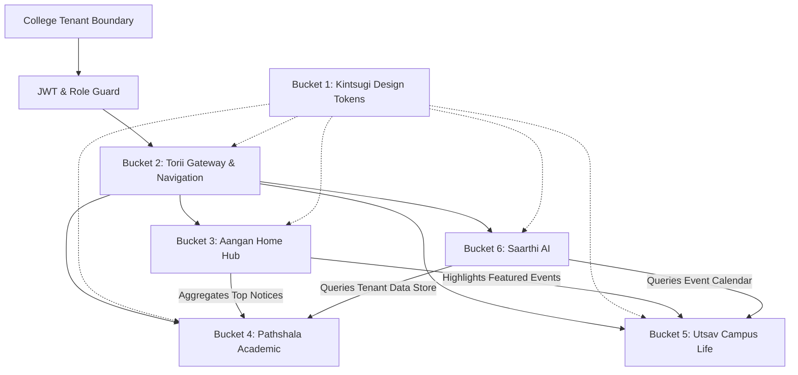

Listed directory campushub
Listed directory docs
Listed directory docs-for-raja
Searched for "Kintsugi"
Searched for "Saarthi"
Searched for "Bucket"
Searched for "Kintsugi"
Listed directory frontend
Viewed PRD.md:1-437
Listed directory app
Listed directory components
Viewed SYSTEM-DESIGN.md:1-270

# CampusHub — Lead Product Designer & Design Architect
## Phase 1 Deliverable: Product Understanding Report, Design Strategy, Complete Screen Inventory & Execution Roadmap

---

### Executive Summary

As Lead Product Designer and Design Architect for **CampusHub**, this document establishes the foundational design doctrine and structural blueprint for the platform. 

CampusHub is not another administrative ERP or generic SaaS dashboard. It is a **student-first digital campus operating system and sanctuary** — designed to replace the fragmented chaos of WhatsApp groups, cluttered bulletin boards, and soulless enterprise portals with a cohesive, calm, and culturally resonant experience.

---

# Part 1: Product Understanding Report

```
                      ┌──────────────────────────────────────────────┐
                      │             TORII (Navigation & IA)          │
                      │  Global Gateway • Omni-Search • Context Bar  │
                      └──────────────────────┬───────────────────────┘
                                             │
             ┌───────────────────────────────┼──────────────────────────────┐
             ▼                               ▼                              ▼
 ┌───────────────────────┐       ┌───────────────────────┐      ┌───────────────────────┐
 │        AANGAN         │       │       PATHSHALA       │      │         UTSAV         │
 │ (Student Home Hub)    │       │ (Academic Experience) │      │ (Campus Life & Clubs) │
 │ Morning Briefing      │       │ Department Streams    │      │ Interactive Posters   │
 │ Priority Circulars    │       │ Syllabi & Schedules   │      │ Cultural & Tech Fests │
 │ Daily Pulse Timeline  │       │ Course Milestones     │      │ RSVPs & Hackathons    │
 └───────────┬───────────┘       └───────────┬───────────┘      └───────────┬───────────┘
             │                               │                              │
             └───────────────────────────────┼──────────────────────────────┘
                                             ▼
                      ┌──────────────────────────────────────────────┐
                      │          SAARTHI (AI Growth & Guide)         │
                      │   College-Bounded Context • Schedule Sync    │
                      │    Circular Q&A • Study & Growth Tracker     │
                      └──────────────────────────────────────────────┘
                                             ▲
                                             │
                      ┌──────────────────────────────────────────────┐
                      │         KINTSUGI (Design Foundation)         │
                      │ Washi Paper • Sumi Ink • Gold Accents • Spacing│
                      └──────────────────────────────────────────────┘
```

---

## 1. Deep Analysis of the Six Experience Buckets

### Bucket 1 — Kintsugi (Design System Foundation)
* **Archetype & Philosophy:** The Japanese art of repairing broken pottery with gold lacquer (*Kintsugi*), combined with *Wabi-Sabi* (beauty in simplicity and authenticity) and subtle Indian warmth.
* **Core Function:** Establishes the design tokens, typography scale, spatial grid, elevation system, motion physics, and accessible color tokens across Light (*Washi Dawn*) and Dark (*Sumi Night*) themes.
* **Emotional Tone:** Quiet, intentional, grounding, premium. Free of neon SaaS saturation; anchored in warm bone whites, sumi slate blacks, deep indigo, warm terracotta, and subtle hairline veins of liquid gold (`#D4AF37` / `#E5C158`).

### Bucket 2 — Torii (Navigation & Information Architecture)
* **Archetype & Philosophy:** The sacred Japanese *Torii* gate — marking the transition from the chaotic external world into a focused, organized campus sanctuary.
* **Core Function:** Universal navigation architecture, responsive adaptive layout (Floating Dock for desktop, Ergonomic Thumb Bar for mobile), global command palette (`Cmd+K` / Omni-Search), and multi-tenant college context switcher.
* **Emotional Tone:** Effortless transition, zero friction, spatial clarity.

### Bucket 3 — Aangan (Student Home Experience)
* **Archetype & Philosophy:** The traditional Indian *Aangan* (central open-air courtyard) where family members gather to share daily news, morning light, and collective connection.
* **Core Function:** The student's primary morning landing experience. Delivers a contextual morning briefing card, unread pulse indicator, high-priority pinned circulars, personalized daily timeline, and filtered announcement stream.
* **Emotional Tone:** Warm welcome, clear priority hierarchy, zero cognitive overwhelm.

### Bucket 4 — Pathshala (Academic Experience)
* **Archetype & Philosophy:** The *Pathshala* / *Gurukul* — an unhurried, dedicated sanctuary for scholarly pursuit, course materials, and department knowledge.
* **Core Function:** Department-scoped noticeboards, curriculum timelines, lecture schedule viewers, faculty circular archives, assignment deadlines, and distraction-free document reading viewports.
* **Emotional Tone:** Structured, distraction-free, legible, focused.

### Bucket 5 — Utsav (Campus Life & Community)
* **Archetype & Philosophy:** *Utsav* (festival / celebration) — vibrant community spirit, creativity, club culture, and campus energy, balanced with clean structure.
* **Core Function:** Visual poster showcase with full-bleed lightbox and pinch-to-zoom, event calendar, hackathon/cultural fest directory, one-tap RSVP ticketing, and club discovery hubs.
* **Emotional Tone:** Energetic yet refined, visually rich, engaging, celebratory.

### Bucket 6 — Saarthi (AI Assistant & Personal Growth)
* **Archetype & Philosophy:** *Saarthi* (the wise charioteer/guide) — a calm, non-intrusive companion navigating academic complexity and campus deadlines.
* **Core Function:** Tenant-bounded contextual intelligence (able to answer questions like *"When is the internal submission deadline for DSP?"* using verified college circulars), schedule assistant, natural language search assistant, and growth tracker.
* **Emotional Tone:** Reassuring, discreet, precise, hyper-focused on student welfare without unsolicited chatbot spam.

---

## 2. Target User Personas & Core Journeys

| Persona | Core Motivations | Primary Pain Points | Key Touchpoints |
| :--- | :--- | :--- | :--- |
| **Aarav (2nd Year CS Student)** | Needs urgent exam notices, club workshops, hackathon alerts; wants zero WhatsApp clutter. | Misses pinned deadlines buried in 20+ active chat groups; duplicate posters. | `Aangan` Morning Briefing, `Pathshala` Dept Stream, `Utsav` Event RSVP, `Saarthi` Query. |
| **Prof. Sharma (Dept. Faculty / HOD)** | Needs to broadcast exam schedules and circulars to exact cohorts without reposting. | Students asking repetitive questions; no read receipt verification; complex ERPs. | Announcement Studio, PDF/Poster Attachment Uploader, Department Filter Selector. |
| **Ananya (Cultural Club Lead)** | Needs to build excitement for college fest, showcase posters, and track RSVPs. | Low visibility outside forwarded messages; unreadable compressed images. | `Utsav` Event Creator, High-Res Poster Showcase, Attendee Management. |
| **Dean Dr. Mukherjee (College Admin)** | Needs institution-wide governance, moderation, tenant isolation, and audit readiness. | Unauthorized notices; fragmented cross-department communications. | Tenant Admin Console, Global Circular Dispatcher, Role/Department Manager. |

---

## 3. Critical Architectural Dependencies & Cross-Module Relationships



### Key Technical & Experience Constraints
1. **Multi-Tenant Scoping:** Every query, announcement, event, and AI inference must strictly resolve against `collegeId`. Zero cross-tenant data leaks.
2. **Media Optimization:** Event posters stored on Cloudinary must render with responsive `srcset`, blurred placeholder shimmer, and high-DPI zoom without layout shifts (CLS < 0.05).
3. **Role-Adaptive Affordances:** The UI dynamically morphs between Student (consumption/RSVP/search), Faculty (publish/manage), and Admin (moderate/metrics) without disrupting the core visual harmony.

---

## 4. Design Risks & Mitigation Strategy

| Risk | Nature | Impact | Mitigation Strategy |
| :--- | :--- | :--- | :--- |
| **"ERP Feature Creep"** | Experience | Cluttered, overwhelming forms and tables alienate students. | Strict adherence to *Japanese Minimalist* spatial density; progressive disclosure; card-based modularity. |
| **"Poster Chaos"** | Visual | Low-res or wildly sized user-uploaded posters break UI harmony. | Adaptive aspect-ratio containers (4:5, 16:9) with ambient blurred backdrop glow and full-bleed pinch-to-zoom modals. |
| **"AI Hallucination in Notices"** | Functional | `Saarthi` answering incorrect dates or policies. | Strict RAG prompt boundaries restricted only to verified official college announcements and metadata with cited source badges. |
| **"Excessive Notification Fatigue"** | Cognitive | Pushing too many alerts mimics WhatsApp noise. | Daily `Aangan` Digest categorization (Urgent vs. Academic vs. Social); user-configurable quiet hours. |

---

# Part 2: Unified Design Strategy

```
                          ┌───────────────────────────┐
                          │   CAMPUSHUB DESIGN DOCTRINE│
                          │   "Sanctuary of Learning" │
                          └─────────────┬─────────────┘
                                        │
           ┌────────────────────────────┴────────────────────────────┐
           ▼                                                         ▼
┌──────────────────────────────────────┐  ┌──────────────────────────────────────┐
│        JAPANESE MINIMALISM           │  │       INDIAN HERITAGE ACCENTS        │
├──────────────────────────────────────┤  ├──────────────────────────────────────┤
│ • Ma (Negative space & breathing room)│  │ • Aangan (Courtyard central layout)  │
│ • Kanso (Simplicity & elimination)   │  │ • Jali-inspired hairline geometry    │
│ • Kintsugi (Gold repair & accents)   │  │ • Terracotta, Saffron & Sand palette │
│ • Shizen (Natural harmony & flow)    │  │ • Saarthi (Charioteer guidance motif)│
└──────────────────────────────────────┘  └──────────────────────────────────────┘
```

---

## 1. Visual Language & Token Foundations (Preview of Kintsugi)

### Color Palette Architecture
* **Canvas Foundations:**
  * Light Mode (*Washi Dawn*): Canvas `#FBF9F5`, Surface `#FFFFFF`, Elevated Card `#F4EFE6`, Hairline Border `#E6DFD3`.
  * Dark Mode (*Sumi Night*): Canvas `#121316`, Surface `#1A1B20`, Elevated Card `#22242B`, Hairline Border `#2E313B`.
* **Accent & Cultural Highlights:**
  * **Kintsugi Gold:** Primary `#D4AF37`, Glow `#F3E5AB`, Muted Antique `#997D25` (Used for verified badges, active states, priority highlights).
  * **Terracotta Warmth:** `#C85A32` (Used for urgent announcements, critical deadlines).
  * **Vedic Indigo:** `#2E4057` / `#4A6984` (Used for academic structures, department badges).
  * **Cardamom Green:** `#3E7253` (Used for confirmed RSVPs, verified status, active sessions).

### Typography System
* **Primary Display & Headings:** *Plus Jakarta Sans* or *Outfit* paired with classical serif accents (*Cormorant Garamond* / *Playfair Display* for ceremonial headings and quote badges).
* **Body & Interface:** *Inter* / *Plus Jakarta Sans* for microcopy, tabular data, and high-readability body text.
* **Typographic Hierarchy:**
  * `Display 1`: 36px / Line Height 44px / Weight 700 / Letter Spacing -0.02em
  * `Heading 1`: 28px / Line Height 36px / Weight 600 / Letter Spacing -0.01em
  * `Heading 2`: 22px / Line Height 28px / Weight 600 / Letter Spacing 0
  * `Body Large`: 16px / Line Height 24px / Weight 400 & 500
  * `Body Regular`: 14px / Line Height 20px / Weight 400 & 500
  * `Caption / Micro`: 12px / Line Height 16px / Weight 500 / Letter Spacing +0.02em

### Spatial & Layout Grid
* **Golden Ratio & 8pt Spatial Grid:** 4px (micro), 8px (compact), 16px (base), 24px (comfortable), 32px (spacious), 48px (structural *Ma*).
* **Elevation & Glassmorphism:** Ultra-subtle background blur (`backdrop-filter: blur(12px)`), 1px hairline borders with soft inner specular highlights (`box-shadow: inset 0 1px 0 rgba(255,255,255,0.1)`).

---

## 2. Core UX Principles

1. **Calm by Default:** No flashing banners or overwhelming red notification counters. Important items are prioritized through spatial hierarchy and warm gold illumination.
2. **Context-Aware Density:** Mobile screens provide thumb-driven simplicity; desktop screens offer multi-pane master-detail exploration without visual noise.
3. **One-Tap Predictability:** Every circular, notice, or event card can be expanded, saved to calendar, shared, or questioned via Saarthi in a single tap.
4. **Resilient Multilingual & Multi-DPI Readiness:** Built to support dynamic Hindi/regional script rendering alongside English with zero clipping.

---

# Part 3: Complete Screen Inventory

Across all six buckets and core platform capabilities, here is the complete matrix of 28 core and contextual screens:

| Screen ID | Screen Name | Bucket / Module | Target Roles | Complexity | Key States & Modals |
| :--- | :--- | :--- | :--- | :--- | :--- |
| **SCR-01** | **Splash & Tenant Gateway** | Torii / Auth | All / Public | Low | Initial splash, Tenant selector, Tenant detected |
| **SCR-02** | **Student & Faculty Login** | Torii / Auth | Student, Faculty, Admin | Low | Default, Input active, Error, Loading |
| **SCR-03** | **Campus Registration & Role Selection** | Torii / Auth | New Users | Medium | Role select, Dept picker, ID verification, Success |
| **SCR-04** | **Aangan Central Courtyard (Home)** | Aangan | Student, Faculty | High | Morning Briefing, Feed default, Empty, Filtered |
| **SCR-05** | **Announcement Detail & Reader** | Aangan / Pathshala | All Roles | Medium | Full-page read, Attachment viewer, Share drawer |
| **SCR-06** | **Announcement Studio (Publisher)** | Aangan / Admin | Faculty, Admin | High | Draft, Form step, Poster upload preview, Published |
| **SCR-07** | **Pathshala Department Stream** | Pathshala | Student, Faculty | High | All notices, Exam timetable, Syllabus tab, Empty |
| **SCR-08** | **Course Syllabus & Resource Locker** | Pathshala | Student, Faculty | Medium | Module list, PDF preview modal, Download state |
| **SCR-09** | **Academic Milestone & Exam Tracker** | Pathshala | Student | Medium | Calendar view, Upcoming deadlines, Completed |
| **SCR-10** | **Faculty Office Hours & Notice Board** | Pathshala | Student, Faculty | Medium | Faculty list, Office hour slots, Direct notice feed |
| **SCR-11** | **Utsav Campus Life Hub** | Utsav | All Roles | High | Featured carousel, Filter tags, Grid/List view |
| **SCR-12** | **Event Detail & Interactive Poster** | Utsav | All Roles | High | Hero poster, Fullscreen lightbox, RSVP modal |
| **SCR-13** | **Event Creation & Poster Studio** | Utsav | Faculty, Club Leads | High | Multi-step form, Cloudinary crop/preview, Live |
| **SCR-14** | **Club Showcase & Societies Directory** | Utsav | Student, Club Leads | Medium | Club grid, Club profile page, Join request modal |
| **SCR-15** | **My Campus Passes & RSVPs** | Utsav | Student | Medium | Active QR ticket, Past events, Add to Apple/Google Wallet |
| **SCR-16** | **Saarthi AI Sanctuary (Full View)** | Saarthi | All Roles | High | Empty state with prompts, Streaming Q&A, Sources citation |
| **SCR-17** | **Saarthi Drawer / Floating Companion** | Saarthi | All Roles | Medium | Bottom sheet (Mobile), Side drawer (Desktop), Voice/Text |
| **SCR-18** | **Saarthi Growth & Schedule Assistant** | Saarthi | Student | Medium | Week planner, Conflict alerts, Goal tracker |
| **SCR-19** | **Torii Omni-Search & Discovery** | Torii | All Roles | High | Quick search modal (`Cmd+K`), Search results page, Filtered |
| **SCR-20** | **Notification Center & Quiet Digest** | Torii / Aangan | All Roles | Medium | Grouped by urgency, Read/Unread, Settings modal |
| **SCR-21** | **User Profile & Campus ID Card** | Torii | All Roles | Medium | Digital ID badge, Preferences, Security, Dark/Light |
| **SCR-22** | **Admin Tenant Overview & Metrics** | Admin | Admin | High | KPI cards, Content volume graph, Tenant health |
| **SCR-23** | **Admin User & Role Governance** | Admin | Admin | High | User data table, Role elevation modal, Batch invite |
| **SCR-24** | **Admin Department & Course Manager** | Admin | Admin | Medium | Department tree, Create/Edit modal, Deletion guard |
| **SCR-25** | **Admin Content Moderation Vault** | Admin | Admin | High | Flagged notices, Remove/Restore dialog, Audit logs |
| **SCR-26** | **Cloudinary Media Asset Gallery** | Admin / Media | Faculty, Admin | Medium | Grid gallery, Storage metrics, Broken link audit |
| **SCR-27** | **404 & Lost in Campus State** | Core | All Roles | Low | Zen garden error screen with navigation back to Aangan |
| **SCR-28** | **Offline & Reconnection Mode** | Core | All Roles | Low | Offline cache banner, Sync status indicator |

---

# Part 4: Recommended Design Execution Order

To maximize design velocity and maintain visual and systemic consistency, the execution order is structured into 4 sequential phases:

```
┌────────────────────────────────────────────────────────────────────────┐
│ PHASE 3.1: FOUNDATIONAL COMMONS & SHELL                                │
│ [Kintsugi Token System] ➔ [Torii Shell & Mobile Nav] ➔ [Auth & Splash] │
└───────────────────────────────────┬────────────────────────────────────┘
                                    │
┌───────────────────────────────────▼────────────────────────────────────┐
│ PHASE 3.2: CORE STUDENT CONSUMPTION & DISCOVERY                        │
│ [Aangan Home Hub] ➔ [Announcement Reader] ➔ [Torii Omni-Search]        │
└───────────────────────────────────┬────────────────────────────────────┘
                                    │
┌───────────────────────────────────▼────────────────────────────────────┐
│ PHASE 3.3: ACADEMIC & CAMPUS LIFE ECOSYSTEM                            │
│ [Pathshala Dept Stream] ➔ [Utsav Event Hub & Poster Lightbox] ➔ [RSVP] │
└───────────────────────────────────┬────────────────────────────────────┘
                                    │
┌───────────────────────────────────▼────────────────────────────────────┐
│ PHASE 3.4: INTELLIGENCE & GOVERNANCE                                   │
│ [Saarthi AI Assistant] ➔ [Creation Studios] ➔ [Admin Control Center]   │
└────────────────────────────────────────────────────────────────────────┘
```

### Execution Batches Breakdown:

* **Batch 1 (P0 - Immediate Foundation):**
  * `SCR-01` Splash & Tenant Gateway
  * `SCR-02` Student & Faculty Login
  * `SCR-04` Aangan Central Courtyard (Desktop & Mobile)
  * `SCR-05` Announcement Detail & Reader

* **Batch 2 (P1 - Core Experience):**
  * `SCR-07` Pathshala Department Stream
  * `SCR-11` Utsav Campus Life Hub
  * `SCR-12` Event Detail & Interactive Poster Lightbox
  * `SCR-19` Torii Omni-Search & Global Command Palette

* **Batch 3 (P1 - Companion & Creation):**
  * `SCR-16` Saarthi AI Sanctuary & Drawer
  * `SCR-06` Announcement Studio (Faculty/Publisher)
  * `SCR-13` Event Creation & Poster Studio
  * `SCR-15` My Campus Passes & Digital ID (`SCR-21`)

* **Batch 4 (P2 - Administration & Edge States):**
  * `SCR-22` Admin Tenant Overview & Metrics
  * `SCR-23` Admin User & Role Governance
  * `SCR-25` Content Moderation Vault
  * `SCR-27` / `SCR-28` System Edge & Offline States

---

### Request for Approval

This concludes Phase 1 of our product design deliverables. Please review the **Product Understanding Report**, **Design Strategy**, **Complete Screen Inventory**, and **Execution Roadmap**. 

Upon your approval, we will proceed immediately to **Phase 2 (Design System Tokens & Visual Language Finalization)** and **Phase 3 (Screen-by-Screen High-Fidelity UI Specifications starting with Batch 1)**.